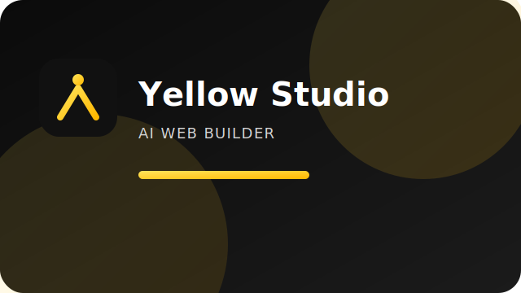
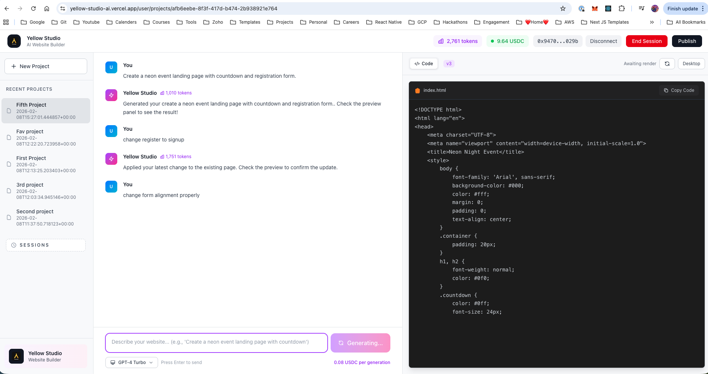

<br>

# Yellow Studio




## Description
Yellow Studio is a chat‑driven AI website builder with live preview, project persistence, and session‑based token/billing tracking. Built for hackathon demo flow.

<br>

## Demo


### Home Page





## Tech stack
- Next.js 16 (App Router) + TypeScript
- Tailwind CSS
- Supabase Postgres
- OpenAI (chat generation)
- MetaMask for wallet connect

## Features (MVP)
- Split‑screen builder: chat + live code/preview
- Streaming HTML generation
- Projects + messages + generations stored in Supabase
- Session tracking (balance + tokens)
- Yellow SDK stubs for state channels (Nitrolite sandbox)
- Sessions list page


## Local setup
1) Install deps
```bash
pnpm install
```

2) Create `.env.local`
```
NEXT_PUBLIC_SUPABASE_URL=...
NEXT_PUBLIC_SUPABASE_ANON_KEY=...
OPENAI_API_KEY=...
```

3) Apply Supabase schema  
Run the SQL from `supabase/schema.sql` in your Supabase SQL editor.

4) Run dev server
```bash
pnpm dev
```

Open http://localhost:3000

## Demo flow
1) Connect wallet (MetaMask).
2) Start session.
3) Create a project.
4) Prompt → generate → preview updates.
5) End session.

## Yellow SDK (Nitrolite sandbox)
- Integration helpers live in `yellow/yellow.ts`.
- Intended wiring points:
  - Start Session → `connectToYellow()` + `setupMessageSigner()`
  - Each generation → `sendPayment()`
  - End Session → settle / close state channel (todo)
- Uses Yellow sandbox websocket for testing (`wss://clearnet-sandbox.yellow.com/ws`).
- Current implementation notes:
  - `connectToYellow()` opens a websocket and logs raw messages from the sandbox ClearNode.
  - `setupMessageSigner()` uses MetaMask `personal_sign` to sign state‑channel messages.
  - `createPaymentSession()` prepares allocations and sends the signed session message to ClearNode.
  - `sendPayment()` signs a lightweight payment payload and pushes it over the socket.
- What still needs wiring:
  - Persist the Yellow session id / channel metadata in `yellow_sessions`.
  - On Start Session: call `createPaymentSession()` and save returned session info.
  - On each generation: call `sendPayment()` and log tx to `transactions`.
  - On End Session: call the settlement/close method once integrated.

## Build
```bash
pnpm run build
```

<br>

## Stakeholders

<div style="display: flex; justify-content: space-between; align-items: center;">
   <p style="flex:1">Shiva Kumar: </p>
   <div style="flex:4; justify-content: space-between;">
      <a href="https://www.linkedin.com/in/shivamangina/" target="_blank">
      
      </a>
      <a href="https://twitter.com/shivakmangina" target="_blank">
      
      </a>
      <a href="https://www.instagram.com/shiva_mangina" target="_blank">
      
      </a>
      <a href="https://github.com/shivamangina" target="_blank">
      
      </a>
   </div>
</div>

<div style="display: flex; justify-content: space-between; align-items: center;">
   <p style="flex:1">Satya Sandeep: </p>
   <div style="flex:4; justify-content: space-between;">
      <a href="https://www.linkedin.com/in/satyasandeep" target="_blank">
      
      </a>
      <a href="https://twitter.com/satyasandeep76" target="_blank">
      
      </a>
      <a href="https://www.instagram.com/satyasandeep007" target="_blank">
      
      </a>
      <a href="https://github.com/satyasandeep007" target="_blank">
      
      </a>
   </div>
</div>
